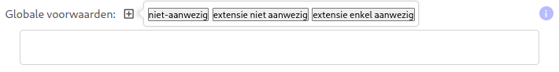
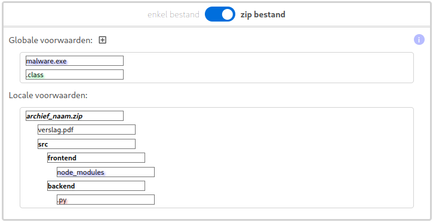

# Project Aanmaken: Simpele Structuur Beperkingen

Docenten kunnen de volledige structuur van een opdracht vastleggen. Ze kunnen de studenten echter ook enige vrijheid bieden, indien gewenst.

Een lesgever kan beslissen of de opdracht een enkel bestand moet zijn of een zip-archief met meerdere bestanden.

## Een bestand als indiening

Wanneer de indiening een enkel bestand betreft, moet de lesgever de naam van dit bestand vastleggen.

## Een zip-archief als indiening

Wanneer de indiening een zip-archief betreft, moet de lesgever ook de naam van dit archief vastleggen.

Naast de naam van het archief kan de volledige interne structuur worden vastgelegd. Er kan echter ook volledige vrijheid worden gegeven, of iets ertussenin.

Door met de muis over het archief te slepen, kunnen er bestanden of mappen aan worden toegevoegd:

Namen die vetgedrukt zijn, stellen mappen voor. Namen in normale tekst zijn bestanden.

Lesgevers die nog meer controle willen over de indiening, kunnen met hun muis over de bestanden of mappen hoveren en op de drie puntjes klikken:

Door op `FOLDER` te klikken, kan een bestand worden veranderd in een map, zoals `mijn_map`.

`NIET_AANWEZIG` zorgt ervoor dat dit bestand niet aanwezig mag zijn in de map waarin de beperking is gedefinieerd (hier `archief_naam.zip`), maar mogelijk wel in andere mappen:

`EXTENSIE_NIET_AANWEZIG` zorgt ervoor dat een bepaalde extensie niet aanwezig mag zijn in de map of het archief waarin de beperking is gedefinieerd:

## Globale voorwaarden

Soms is het nodig om een beperking over de volledige indiening te definiëren. Dit kan in de sectie `globale voorwaarden`.

Men kan vastleggen welke bestanden of extensies niet aanwezig mogen zijn met `NIET_AANWEZIG` en `EXTENSIE_NIET_AANWEZIG`. Men kan ook afdwingen dat enkel een bepaalde extensie aanwezig mag zijn over het hele project (mappen niet meegerekend).

## Voorbeeld

Dit is een zip-indiening waarbij er zeker een extra, src, src/frontend en src/backend map aanwezig moet zijn. In de extra map moet een verslag aanwezig zijn. In de frontend map mag geen node_modules map aanwezig zijn.

Globaal gezien mogen er nergens `.class` bestanden of `malware.exe` aanwezig zijn.
